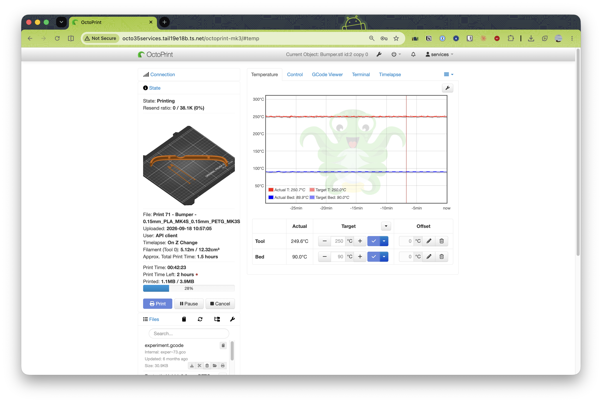

# our octoprint setup

* https://plugins.octoprint.org/plugins/bgcode/
* https://plugins.octoprint.org/plugins/prusaslicerthumbnails/
* https://plugins.octoprint.org/plugins/cancelobject/
* https://plugins.octoprint.org/plugins/webcamextras/
* https://plugins.octoprint.org/plugins/tasmota/
* https://github.com/OctoPrint/OctoPrint-Slic3r (baked into the image with PrusaSlicer, see Dockerfile)

## Slicing profiles

`slic3r-profiles/` holds Prusa's official MK3 and MK4 (input shaper) PLA presets,
flattened for the PrusaSlicer 2.3 in the image. Both are baked into the image and
copied into each instance on start; `SLIC3R_DEFAULT_PROFILE` picks the default.
Regenerate with `slic3r-profiles/generate.sh`, then `docker compose build && docker compose up -d`.

